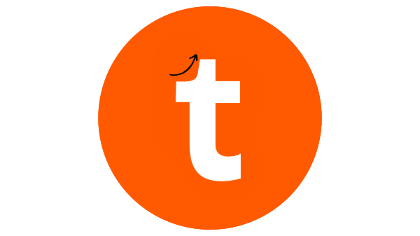

# ThriveUp

> **Campus Pulse at Your Fingertips**

---

 <!-- Replace with your actual banner image if available -->

## ✨ Overview

**ThriveUp** is a professional, feature-rich iOS app (built 100% in Swift) designed to connect students and participants at campus events and hackathons. With ThriveUp, discovering events, finding teammates, and building your campus network is easier than ever—all within a seamless and intuitive app experience.

---

## 🚀 Features

- **Event Discovery & Registration**
  - Browse trending campus events, hackathons, and meetups.
  - Register, bookmark, and keep track of your favorite activities.

- **Smart Swipe-based Matching**
  - Find potential teammates with a swipe, based on interests and skillsets.
  - Build connections for hackathons or event-based collaborations.

- **Team Formation & Management**
  - Create or join hackathon teams effortlessly.
  - Manage team invitations, member roles, and collaboration requests.

- **Real-time Chat & Notifications**
  - Secure in-app messaging for instant communication.
  - Push notifications for new matches, event updates, and more.

- **Rich User Profiles**
  - Highlight your skills, experiences, and social links (GitHub, LinkedIn, etc.).
  - Personalize your profile with images and your tech stack.

- **Powered by Firebase**
  - Secure authentication (including Apple Sign In).
  - Real-time data sync and cloud storage.

---


## 🛠️ Getting Started

### Prerequisites

- macOS with latest Xcode
- CocoaPods or Swift Package Manager
- Firebase Project (for backend)

### Installation

1. **Clone the repository**
   ```bash
   git clone https://github.com/ssanidhya0407/ThriveUp-AppConnect.git
   cd ThriveUp-AppConnect
   ```

2. **Install dependencies**
   - Using CocoaPods:
     ```bash
     pod install
     open ThriveUp-AppConnect.xcworkspace
     ```
   - Or, resolve Swift Package Manager dependencies in Xcode.

3. **Configure Firebase**
   - Create a project in [Firebase Console](https://console.firebase.google.com/)
   - Download `GoogleService-Info.plist` and add it to your Xcode project.

4. **Build and Run**
   - Select a simulator or device, then run the app from Xcode.

---

## 📂 Project Structure

```plaintext
workingModel/
  ├─ Flick/               # Swipe-based matching logic
  ├─ EventGroup/          # Event and team management
  ├─ FirestoreChatManager.swift  # Real-time chat backend
  ├─ DataModel.swift      # App data models
  └─ ...                  # Additional app modules and utilities
```

---

## 🤝 Contributing

Contributions are welcome!  
If you have suggestions, bug reports, or pull requests, please open an issue or submit a PR.

---

## 📄 License

This project is released under the MIT License.  
See [LICENSE](LICENSE) for more details.

---

## 👤 Authors

- [Sanidhya Singh](https://github.com/ssanidhya0407)
- [Yash Gupta](https://github.com/Yash9837)
- [Palak Seth](https://github.com/ps0821)


---

## 📬 Contact

- [Email ThriveUp](thriveupapp@gmail.com)
- For collaborations or questions, feel free to reach out!

---

> _Made for thriving campus communities and collaborative innovation._
